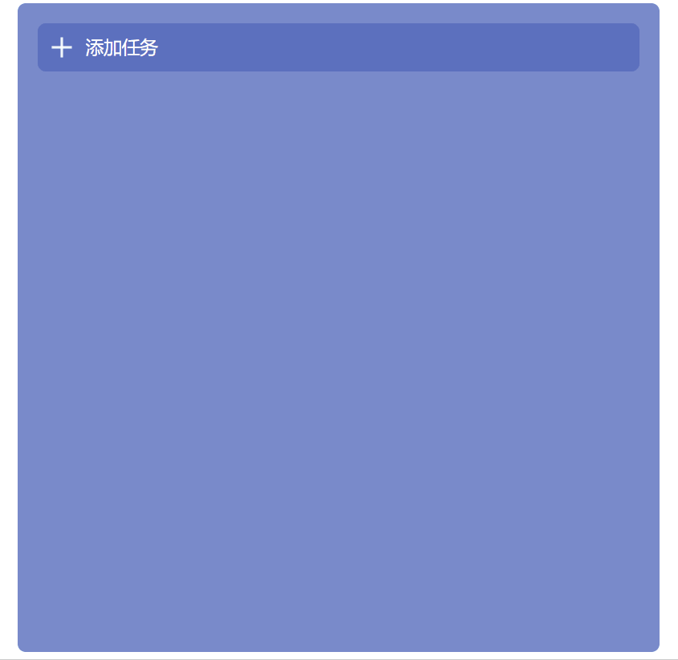
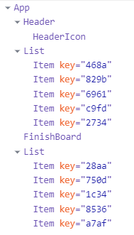

# TodoList

> 这个版本是基于类组件写的，本项目是作为看完React基础进行练习的实践项目。

看视频学习，每学完一部分，进行相应练习，笔记如下：

[学习笔记](https://github.com/lzw1998/charlatan-study)

### 预览

### 优化Todo

- [ ] 看完实战视频，对组件划分进行优化
- [ ] 完成hook版本
- [ ] 看完css的动画部分，优化交互动画

### 组件划分

### 准备

`npm install`

### 启动

`npm start`

